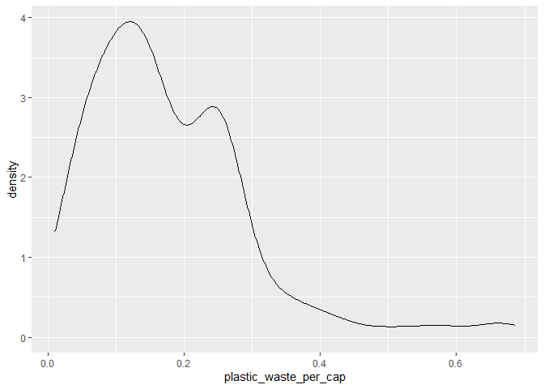
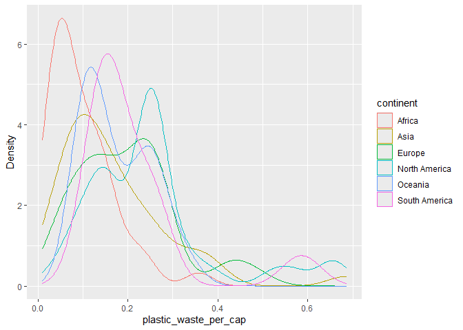
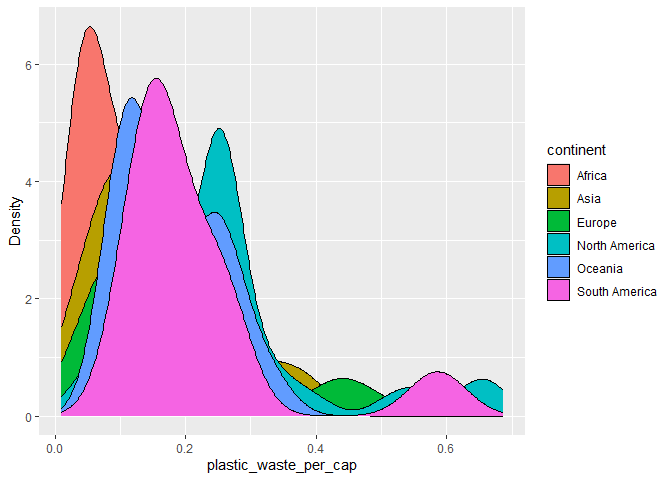
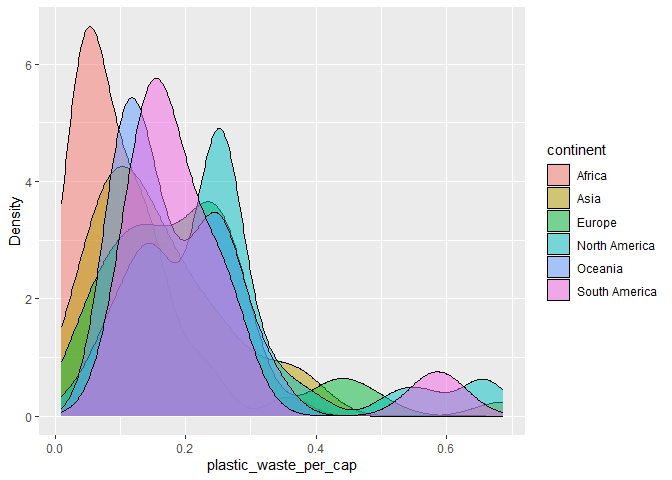
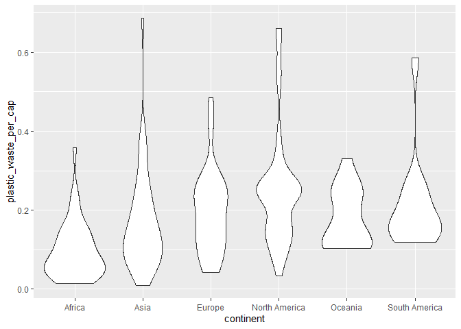

Lab 02 - Plastic waste
================
Samarah Ledoux
2025-09-15

## Chargement des packages et des données

``` r
library(tidyverse) 
```

``` r
plastic_waste <- read_csv("data/plastic-waste.csv")
```

Commençons par filtrer les données pour retirer le point représenté par
Trinité et Tobago (TTO) qui est un outlier.

``` r
plastic_waste <- plastic_waste %>%
  filter(plastic_waste_per_cap < 3.5)
```

## Exercices

### Exercise 1

Que pouvez-vous dire de la comparaison des continents, en terme de
déchets plastiques ?

``` r
ggplot(plastic_waste, aes(x=plastic_waste_per_cap))+
         geom_histogram(binwidth = 0.2)+
         facet_wrap(~continent)
```

<!-- -->

### Exercise 2

``` r
ggplot(plastic_waste, aes(x = plastic_waste_per_cap)) + 
  geom_density()
```

<!-- -->

``` r
ggplot(plastic_waste, aes(x = plastic_waste_per_cap, 
                  color = continent)) +
  geom_density(alpha = 0.5) +
  labs(
    x = "plastic_waste_per_cap",
    y = "Density",
    color = "continent")
```

<!-- -->

``` r
ggplot(plastic_waste, aes(x = plastic_waste_per_cap, 
                  fill = continent)) +
  geom_density() +
  labs(
    x = "plastic_waste_per_cap",
    y = "Density",
    fill = "continent"
  )
```

<!-- -->

``` r
ggplot(plastic_waste, aes(x = plastic_waste_per_cap, 
                  fill = continent)) +
  geom_density(alpha = 0.5) +
  labs(
    x = "plastic_waste_per_cap",
    y = "Density",
    fill = "continent")
```

<!-- -->

Les réglages de color et fill sont dans aes, car ce sont des réglages
reliés à une variable (ici continent), alors que la transparence (alpha)
se trouve dans geom_density() puisqu’il n’est pas relié à une variable.

### Exercise 3

Boxplot:

``` r
ggplot(plastic_waste, aes(x = continent,
                  y = plastic_waste_per_cap)) +
  geom_boxplot()
```

<!-- -->

Violin plot:

``` r
ggplot(plastic_waste, aes(x = continent, y = plastic_waste_per_cap)) +
  geom_violin()
```

<!-- -->

Le boxplot nous montre seulement la valeur centrale (ligne dans le
carré), alors que les violin plots nous permet de voir la dispersion en
dessous et au dessous de la moyenne en montrant comment évolue la
quantité de déchets par personnes.

### Exercise 4

``` r
# insert code here
```

Réponse à la question…

### Exercise 5

``` r
# insert code here
```

``` r
# insert code here
```

Réponse à la question…

## Conclusion

Recréez la visualisation:

``` r
# insert code here
```
