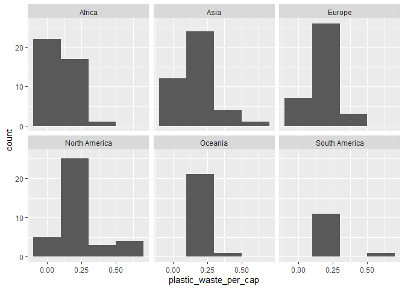
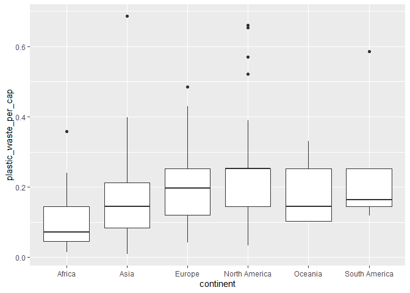
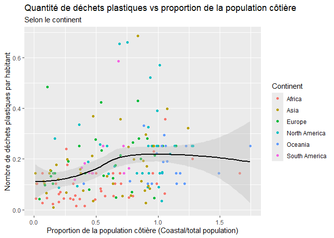

Lab 02 - Plastic waste
================
Samarah Ledoux
2025-09-15

## Chargement des packages et des données

``` r
library(tidyverse) 
```

``` r
plastic_waste <- read_csv("data/plastic-waste.csv")
```

Commençons par filtrer les données pour retirer le point représenté par
Trinité et Tobago (TTO) qui est un outlier.

``` r
plastic_waste <- plastic_waste %>%
  filter(plastic_waste_per_cap < 3.5)
```

## Exercices

### Exercise 1

Que pouvez-vous dire de la comparaison des continents, en terme de
déchets plastiques ?

``` r
ggplot(plastic_waste, aes(x=plastic_waste_per_cap))+
         geom_histogram(binwidth = 0.2)+
         facet_wrap(~continent)
```

<!-- -->

### Exercise 2

``` r
ggplot(plastic_waste, aes(x = plastic_waste_per_cap)) + 
  geom_density()
```

<!-- -->

``` r
ggplot(plastic_waste, aes(x = plastic_waste_per_cap, 
                  color = continent)) +
  geom_density(alpha = 0.5) +
  labs(
    x = "plastic_waste_per_cap",
    y = "Density",
    color = "continent")
```

<!-- -->

``` r
ggplot(plastic_waste, aes(x = plastic_waste_per_cap, 
                  fill = continent)) +
  geom_density() +
  labs(
    x = "plastic_waste_per_cap",
    y = "Density",
    fill = "continent"
  )
```

<!-- -->

``` r
ggplot(plastic_waste, aes(x = plastic_waste_per_cap, 
                  fill = continent)) +
  geom_density(alpha = 0.5) +
  labs(
    x = "plastic_waste_per_cap",
    y = "Density",
    fill = "continent")
```

<!-- -->

Les réglages de color et fill sont dans aes, car ce sont des réglages
reliés à une variable (ici continent), alors que la transparence (alpha)
se trouve dans geom_density() puisqu’il n’est pas relié à une variable.

### Exercise 3

Boxplot:

``` r
ggplot(plastic_waste, aes(x = continent,
                  y = plastic_waste_per_cap)) +
  geom_boxplot()
```

<!-- -->

Violin plot:

``` r
ggplot(plastic_waste, aes(x = continent, y = plastic_waste_per_cap)) +
  geom_violin()
```

<!-- -->

Le boxplot nous montre seulement la valeur centrale (ligne dans le
carré), alors que les violin plots nous permet de voir la dispersion en
dessous et au dessous de la moyenne en montrant comment évolue la
quantité de déchets par personnes.

### Exercise 4

``` r
ggplot(plastic_waste, aes(x=plastic_waste_per_cap,
                          y=mismanaged_plastic_waste_per_cap,
                          color=continent)) +
  geom_point()
```

<!-- -->

``` r
ggplot(plastic_waste, aes(x=plastic_waste_per_cap,
                          y=mismanaged_plastic_waste_per_cap,
                          color=continent)) +
  geom_point()+
  facet_wrap(~ continent)
```

<!-- -->

relation avec juste les points ??? tendance avec les points par
continent ???

### Exercise 5

``` r
ggplot(plastic_waste, aes(x=total_pop,
                          y=plastic_waste_per_cap))+
  geom_point()
```

    ## Warning: Removed 10 rows containing missing values or values outside the scale range
    ## (`geom_point()`).

<!-- -->

``` r
ggplot(plastic_waste, aes(x=coastal_pop,
                          y=plastic_waste_per_cap))+
  geom_point()
```

<!-- -->

Non, les deux graphiques semblent très semblables, les données avec la
population étant aux côtes semblent un peu plus dispersées en augmentant
la population (vers la droite), mais la relation a l’air presque
identique.

## Conclusion

Je remarque que les points représentent bien la relation, car ils se
regroupent autour de la courbe de tendance, mais pas d’une manière
linéaire. Les habitants de l’asie et de l’océanie semblent avoir la plus
grande quantité de déchets, la plupart des habitants des continents se
situent entre 0 et 0,3 kg de déchets par jour et l’Afrique a l’air
d’être le continent le moins pire avec les plus bas taux de déchets en
dessous de la courbe de tendance.

``` r
ggplot(data=plastic_waste %>% 
  mutate(coastal_pop_prop = coastal_pop / total_pop) %>%
  filter(plastic_waste_per_cap < 3), aes(x = coastal_pop_prop,
                     y = plastic_waste_per_cap,
                     colour = continent)) +
  geom_point() +
  geom_smooth(method = "loess", 
               se=TRUE, 
               colour="black", 
               fill="grey") +
  labs(title = "Quantité de déchets plastiques vs proportion de la population côtière",
       subtitle = "Selon le continent",
       x = "Proportion de la population côtière (Coastal/total population)", y = "Nombre de déchets plastiques par habitant",
       colour = "Continent")
```

    ## `geom_smooth()` using formula = 'y ~ x'

    ## Warning: Removed 10 rows containing non-finite outside the scale range
    ## (`stat_smooth()`).

    ## Warning: Removed 10 rows containing missing values or values outside the scale range
    ## (`geom_point()`).

<!-- -->
